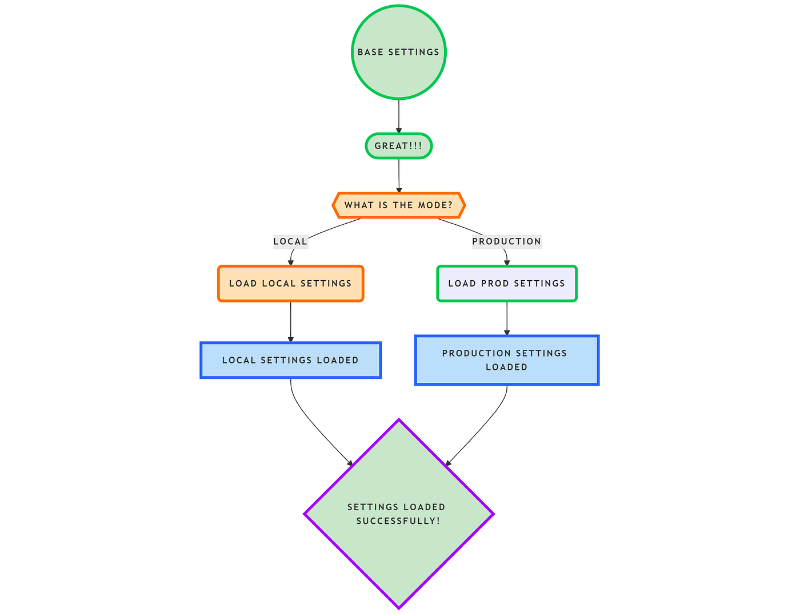
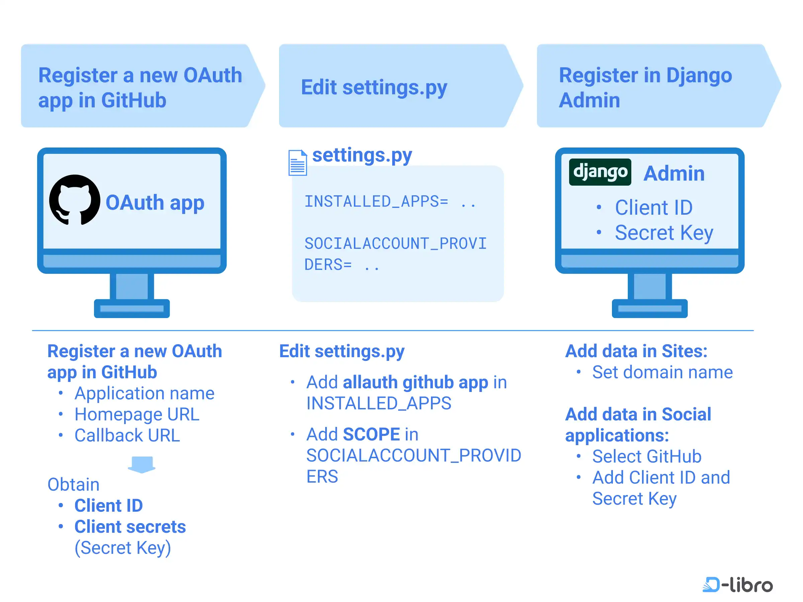
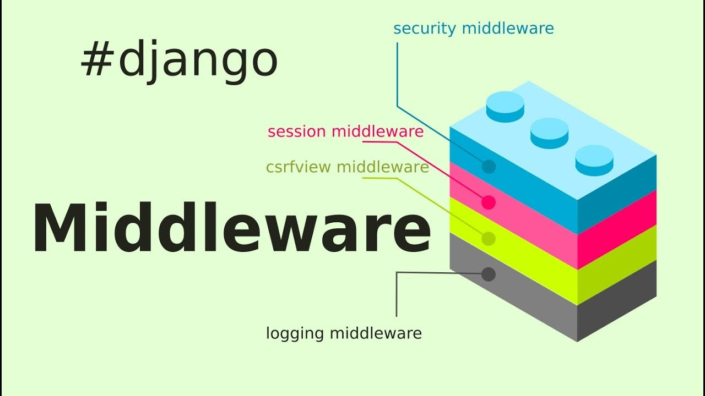
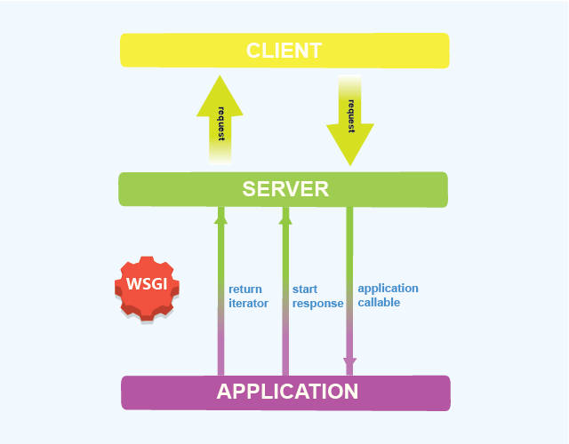

# Django Web Framework: Technical Analysis and Implementation Guide

---

## 1. Configuration Management: Settings File (`settings.py`)

The `settings.py` file serves as the central configuration repository for Django applications, establishing the operational parameters across different deployment environments. This module-based configuration system enables environment-specific customization while maintaining code consistency.

### Core Configuration Components

**Application Architecture:**
- `INSTALLED_APPS`: Defines active Django applications and their dependencies
- `MIDDLEWARE`: Configures request/response processing pipeline
- `ROOT_URLCONF`: Specifies URL routing configuration

**Data Layer Configuration:**
- `DATABASES`: Database connection parameters and engine configuration
- `CACHES`: Backend caching system configuration
- `BROKERS` (when using Celery): Asynchronous task queue configuration

**Security Framework:**
- `SECRET_KEY`: Cryptographic key for session management and security tokens
- `SECURE_*`: SSL/TLS enforcement settings for production environments
- `ALLOWED_HOSTS`: Host header validation for security

**Asset Management:**
- `STATIC_URL/STATIC_ROOT`: Static file serving configuration
- `MEDIA_URL/MEDIA_ROOT`: User-uploaded file handling
- `TEMPLATES`: Template engine and directory configuration

### Environment-Specific Configuration
Django's settings support multiple configuration patterns:

```python
# Development environment
DEBUG = True
DATABASES = {
    'default': {
        'ENGINE': 'django.db.backends.sqlite3',
        'NAME': BASE_DIR / 'db.sqlite3',
    }
}

# Production environment  
DEBUG = False
DATABASES = {
    'default': {
        'ENGINE': 'django.db.backends.postgresql',
        'NAME': os.environ.get('DB_NAME'),
        'USER': os.environ.get('DB_USER'),
        'PASSWORD': os.environ.get('DB_PASSWORD'),
        'HOST': os.environ.get('DB_HOST'),
    }
}
```

### Implementation Considerations
- Configuration drift prevention through environment variable management
- Security hardening through proper secret key management
- Performance optimization via caching and database connection pooling



---

## 2. Cryptographic Security: The SECRET_KEY

The `SECRET_KEY` serves as Django's primary cryptographic signing mechanism, generating a cryptographically secure random string of 50 characters. This key underpins Django's built-in security framework and must be treated with the highest security protocols.

### Cryptographic Applications

**Session Management:**
- HMAC-SHA256 signing for session cookies
- Prevents session fixation and cookie tampering
- Ensures session integrity across distributed systems

**Cross-Site Request Forgery (CSRF) Protection:**
- CSRF token generation and validation
- Provides request origin verification
- Mitigates CSRF attack vectors

**Password Reset Functionality:**
- Cryptographic token generation for password reset links
- Time-limited token validation
- Secure token generation without predictable patterns

**Data Integrity Verification:**
- Digital signatures for cached data
- Form data validation
- API request authentication

### Security Implications

**Exposure Risks:**
```python
# VULNERABLE: Hardcoded secret key
SECRET_KEY = "django-insecure-production-key-12345"

# SECURE: Environment variable loading
SECRET_KEY = os.environ.get('DJANGO_SECRET_KEY')
```

**Compromise Impact:**
- Complete session hijacking capability
- CSRF protection bypass
- Password reset token forgery
- Database modification through admin interface exploitation
- API authentication bypass

### Implementation Best Practices

**Development Environment:**
```python
# Secure development key generation
from django.core.management.utils import get_random_secret_key
SECRET_KEY = get_random_secret_key()
```

**Production Deployment:**
- Generate unique keys using cryptographically secure random generators
- Store in environment variables or secure key management systems
- Implement key rotation procedures
- Never commit to version control systems
- Use different keys for staging and production environments

**Enterprise Security Standards:**
- Integration with HashiCorp Vault, AWS Secrets Manager, or Azure Key Vault
- Automated key rotation policies
- Access logging and monitoring
- Key usage audit trails


---

## 3. Core Application Architecture: Default Django Apps

Django's modular architecture leverages a comprehensive suite of built-in applications that form the foundation of any Django project. These applications follow the principle of "batteries-included," providing essential functionality without requiring external dependencies.

### Core Framework Applications

**Administrative Interface (`django.contrib.admin`):**
- Automated admin interface generation with customizable CRUD operations
- Role-based access control with granular permissions
- Bulk operations, filtering, and search capabilities
- Automatic form generation from model definitions
- Integration with Django's authentication system

**Authentication Framework (`django.contrib.auth`):**
- User model with extensible profile fields
- Group-based permission management
- Session-based authentication
- Password hashing with PBKDF2, bcrypt, scrypt, and Argon2
- User creation, validation, and password reset workflows

**Content Type Framework (`django.contrib.contenttypes`):**
- Generic foreign key relationships for polymorphic associations
- Dynamic model creation and management
- Cross-application relationship tracking
- Database schema evolution support

**Session Management (`django.contrib.sessions`):**
- Server-side session storage with configurable backends
- Session security with CSRF protection
- Database, cache, file, and signed cookie session backends
- Session timeout and invalidation capabilities

**Messaging Framework (`django.contrib.messages`):**
- Cookie-based and session-based message storage
- Multiple message levels (debug, info, success, warning, error)
- Frontend-agnostic message handling
- Automatic message cleanup and expiration

**Static File Management (`django.contrib.staticfiles`):**
- Static file collection and serving optimization
- Development and production static file handling
- File compression and minification support
- CDN integration capabilities

### Extended Framework Components

**Site Framework (`django.contrib.sites`):**
- Multi-site functionality within single Django instance
- Site-specific configuration and content management
- Cross-site relationship handling

**Template Humanization (`django.contrib.humanize`):**
- Template filters for natural language processing
- Date, number, and text formatting utilities
- Internationalization support for user-facing content

**Sitemap Generation (`django.contrib.sitemaps`):**
- Automated XML sitemap creation for search engines
- Customizable sitemap items with priority and frequency
- Integration with Django's URL system

### Third-Party Integration Patterns

**API Development:**
```python
INSTALLED_APPS = [
    'django.contrib.admin',
    'django.contrib.auth',
    'django.contrib.contenttypes',
    'django.contrib.sessions',
    'django.contrib.messages',
    'django.contrib.staticfiles',
    'rest_framework',  # Django REST Framework
    'corsheaders',      # Cross-Origin Resource Sharing
]
```

**Microservice Architecture:**
- Service mesh integration with Django applications
- Event-driven communication patterns
- Container-based deployment strategies

### Application Dependency Analysis

**Core Dependencies:**
- `django.contrib.admin` depends on `django.contrib.auth`, `django.contrib.contenttypes`, `django.contrib.sessions`
- `django.contrib.sessions` requires database migrations
- Authentication applications require proper session configuration

**Performance Considerations:**
- Admin interface impact on application startup time
- Session backend selection based on scalability requirements
- Static file handling optimization for high-traffic applications


---

## 4. Middleware

Middleware is a framework of hooks into Django’s request/response processing.

It is a layer between:
- The web server and the view
- The view and the response

Middleware can:
- Modify requests before reaching views
- Modify responses before returning to the client
- Block requests entirely

### Example
-  Banking apps block unauthenticated users before views run.



---

## 5. Middleware Classification & Security Architecture

Django's middleware architecture implements defense-in-depth security principles through a hierarchical classification system that addresses various security concerns and operational requirements.

### Core Security Middleware Components

**1. SecurityMiddleware - Primary Defense Layer**
- **Clickjacking Protection**: Implements X-Frame-Options header with DENY/SAMEORIGIN policies
- **Cross-Site Scripting (XSS) Mitigation**: Enables X-XSS-Protection header and Content-Type sniffing prevention
- **SSL/TLS Enforcement**: Implements HTTP Strict Transport Security (HSTS) with configurable max-age and subdomain inclusion
- **Content Security Policy (CSP)**: Framework for specifying content security policies through custom headers

**2. SessionMiddleware - State Management Security**
- **Session Security**: Cryptographic signing using HMAC-SHA256 with SECRET_KEY
- **Session Fixation Prevention**: Automatic session key regeneration after authentication
- **Secure Cookie Configuration**: HttpOnly, Secure, and SameSite cookie attributes
- **Backend Abstraction**: Database, cache-based, file-based, and signed cookie implementations

**3. AuthenticationMiddleware - Identity Context Management**
- **User Object Injection**: Automatic request.user population with lazy evaluation
- **Anonymous User Handling**: Graceful handling of unauthenticated requests
- **Permission Context**: Integration with Django's permission system for authorization checks

**4. CSRFViewMiddleware - Request Forgery Prevention**
- **Token Generation**: Cryptographically secure CSRF token creation per session
- **Origin Verification**: Request origin validation against configured allowed hosts
- **Exempt Mechanism**: Decorator-based CSRF protection exemption for specific views
- **AJAX Integration**: Automatic CSRF token inclusion for AJAX requests

**5. CommonMiddleware - Infrastructure Optimization**
- **URL Normalization**: Automatic trailing slash addition and canonical URL enforcement
- **Content-Length Management**: Proper HTTP header management for response optimization
- **ETag Implementation**: Entity tag generation for conditional request handling

### Specialized Middleware Components

**GZipMiddleware - Performance Optimization:**
- **Response Compression**: Automatic gzip compression for text-based responses
- **Threshold Configuration**: Configurable minimum response size for compression
- **Browser Compatibility**: Graceful degradation for browsers without gzip support

**LocaleMiddleware - Internationalization:**
- **Language Detection**: Automatic language detection from request parameters or headers
- **Translation Activation**: Dynamic translation activation based on user preferences
- **URL Internationalization**: Integration with Django's i18n URL patterns

**CacheMiddleware - Performance Caching:**
- **Response Caching**: Intelligent response caching based on cache-control headers
- **Cache Invalidation**: Automatic cache invalidation upon data modifications
- **Distributed Caching**: Integration with Memcached, Redis, and other cache backends

---

## 6. Django Security Framework: Comprehensive Protection Architecture

Django implements a multi-layered security framework that provides defense-in-depth protection against common web application vulnerabilities. This security architecture operates through automatic configuration, secure defaults, and comprehensive middleware integration.

### Security Architecture Components

**1. Authentication & Authorization Framework**
- Multi-factor authentication support through third-party integrations
- Permission-based access control with granular object-level permissions
- Session security with configurable timeout and invalidation policies
- Password hashing using industry-standard algorithms (PBKDF2, bcrypt, scrypt, Argon2)

**2. Input Validation & Sanitization**
- Automatic SQL injection prevention through parameterized queries
- Template auto-escaping to prevent XSS attacks
- File upload validation with configurable MIME type restrictions
- Custom validator framework for domain-specific validation requirements

**3. Cryptographic Protection**
- HMAC-based request signing for API endpoints
- Secure random number generation for token creation
- TLS/SSL enforcement with HSTS implementation
- Cookie security with HttpOnly and Secure flags

**4. Cross-Site Request Forgery (CSRF) Mitigation**
- Token-based request validation with session binding
- Origin verification for all state-changing requests
- AJAX request handling with automatic token inclusion
- Configurable exemption mechanisms for third-party integrations

**5. Content Security Policy (CSP) Implementation**
- X-Frame-Options header for clickjacking prevention
- Content-Type sniffing prevention
- XSS Protection header implementation
- Referrer Policy enforcement

### Security Configuration Best Practices

```python
# Production Security Configuration
SECURE_SSL_REDIRECT = True
SECURE_HSTS_SECONDS = 31536000
SECURE_HSTS_INCLUDE_SUBDOMAINS = True
SECURE_HSTS_PRELOAD = True
SECURE_CONTENT_TYPE_NOSNIFF = True
SECURE_BROWSER_XSS_FILTER = True
SECURE_REFERRER_POLICY = "strict-origin-when-cross-origin"

# Session Security
SESSION_COOKIE_SECURE = True
SESSION_COOKIE_HTTPONLY = True
SESSION_COOKIE_SAMESITE = "Lax"
SESSION_COOKIE_AGE = 3600  # 1 hour

# CSRF Protection
CSRF_COOKIE_SECURE = True
CSRF_COOKIE_HTTPONLY = True
CSRF_COOKIE_SAMESITE = "Lax"
```


---

## 7. CSRF (Cross-Site Request Forgery)

### What is CSRF?
An attack where a malicious website tricks a user’s browser into performing unwanted actions on a trusted site.

### Django Protection
- Generates a unique CSRF token per session
- Validates token on every POST request

### Middleware Involved
- `CsrfViewMiddleware`

### Example
- Stops malicious money transfer requests.

.jpg)

---

## 8. XSS (Cross-Site Scripting)

### What is XSS?
An attack where malicious JavaScript is injected into web pages.

### Django Protection
- Auto-escaping in templates
- Safe template rendering

### Best Practices
- Never trust user input
- Avoid using `|safe` unless necessary

### Example
- Protects comment sections from malicious JS.

.jpg)

---

## 9. Clickjacking

### What is Clickjacking?
A technique where users are tricked into clicking hidden elements inside an iframe.

### Django Protection
- Sets `X-Frame-Options` header
- Prevents site from being embedded in iframes

### Middleware Involved
- `XFrameOptionsMiddleware`

### Example
- Stops fake payment overlays.


---

## 10. Other Important Middleware

- `GZipMiddleware` – Compresses responses
- `LocaleMiddleware` – Language selection
- `BrokenLinkEmailsMiddleware` – Emails admins on 404 errors

---

## 11. What is WSGI?

**WSGI (Web Server Gateway Interface)** is a standard interface between:
- Web servers (Apache, Nginx)
- Python web applications (Django)

### Why WSGI?
- Ensures portability
- Allows Django apps to run on different servers

Django exposes a `wsgi.py` file which is used by production servers to communicate with the application.

### Example
- Enables Django apps to run in production.



---

## 12. Models File (`models.py`)

The `models.py` file defines the database schema using Python classes.

Each model:
- Maps to a database table
- Each field maps to a column

### Example
- Book and Author tables in a library system.


---

## 13. `on_delete=models.CASCADE`

### What does it mean?
When a referenced object is deleted, all related objects are also deleted.

### Example
If a `User` is deleted, all related `Posts` are deleted automatically.

### Other Options
- `SET_NULL`
- `PROTECT`
- `SET_DEFAULT`
- `DO_NOTHING`

---

## 14. Fields and Validators (Broad Overview)

### Common Fields
- `CharField`
- `TextField`
- `IntegerField`
- `FloatField`
- `BooleanField`
- `DateField`
- `DateTimeField`
- `ForeignKey`
- `ManyToManyField`
- `OneToOneField`

### Validators
Validators enforce rules on data before saving.

Examples:
- `MaxLengthValidator`
- `MinValueValidator`
- `EmailValidator`
- Custom validators


---

## 15. Python Module vs Python Class

### Python Module
- A `.py` file
- Used to organize code
- Example: `models.py`, `views.py`

### Python Class
- Blueprint for creating objects
- Defines attributes and methods
- Example: Django model class

A module can contain multiple classes.

### Example
- `models.py` contains multiple model classes.


---

## 16. Django ORM

The Django ORM (Object Relational Mapper) allows interaction with the database using Python instead of raw SQL.

Benefits:
- Database abstraction
- Security against SQL injection
- Cleaner and readable code

### Example
- Fetch paid orders without writing SQL.


---

## 17. Using ORM Queries in Django Shell

Django shell allows testing ORM queries interactively.

Examples:
- `Model.objects.all()`
- `Model.objects.filter()`
- `Model.objects.get()`
- `Model.objects.exclude()`

---

## 18. Turning ORM into SQL in Django Shell

Django allows viewing the SQL generated by ORM queries.

Methods:
- `queryset.query`
- `django.db.connection.queries`

Useful for:
- Debugging
- Performance optimization

---

## 19. Aggregations

Aggregations compute summary values over querysets.

Examples:
- `Sum`
- `Count`
- `Avg`
- `Max`
- `Min`

Used when you want totals or averages.

---

## 20. Annotations

Annotations add calculated fields to each object in a queryset.

Difference:
- Aggregation → single summary result
- Annotation → per-object calculation

Used for advanced queries.

---

## 21. Migration Files

Migration files track changes to models over time.

### Why needed?
- Keeps database schema in sync with models
- Enables version control for database structure
- Supports rollback and forward changes

Generated using:
- `makemigrations`
- `migrate`

### Example
- Adding phone number field safely.


---

## 22. SQL Transactions (Non-ORM Concept)

A transaction is a sequence of database operations executed as a single unit.

Properties (ACID):
- Atomicity
- Consistency
- Isolation
- Durability

Ensures data integrity.

---

## 23. Atomic Transactions

Atomic transactions ensure that:
- Either all operations succeed
- Or all operations fail and rollback

### Django Support
- `transaction.atomic()`

Used when multiple database operations must be treated as one.

### Example
- Online payment processing.


--- 